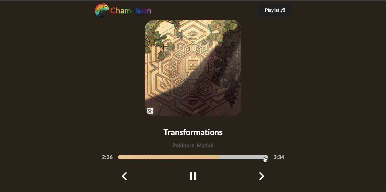

Explore [Chameleon Playlist](https://JayTef.github.io/Chameleon-Playlist).

# Chameleon Playlist

Welcome to Chameleon Playlist! The interface dynamically adjusts to the color palette of each album cover, much like a chameleon changes its colors to match its surroundings. Dive into a full music experience with Chameleon Playlist, where the visuals match the beat and mood of your favorite songs. Enjoy a seamless blend of sight and sound.



## Setup instructions

### Environment requirements

To run this project, you need the following environment set up on your machine:

- Node.js (v18.17.1)
- React (v18.2.0)
- A package manager like npm (comes with Node.js) or Yarn
- SCSS compiler for styling

### Run the project

1. Choose ***Chameleon*** as the root directory
2. ```npm install```
3. ```npm install node-sass```
4. ```npm start```
